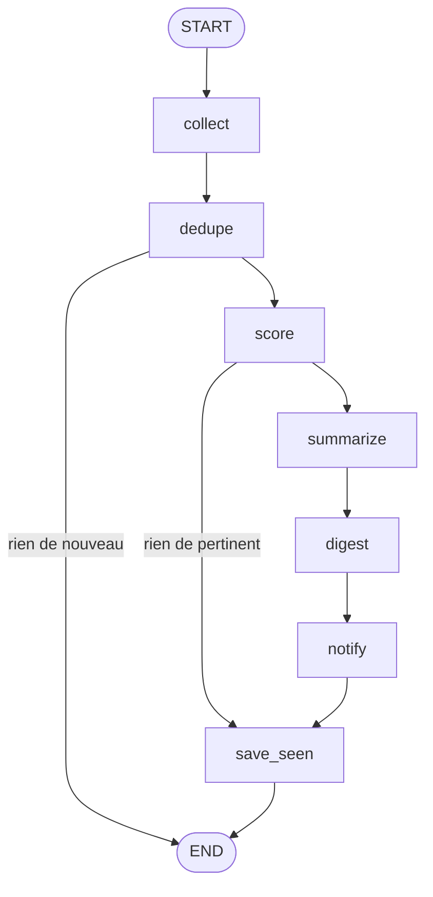
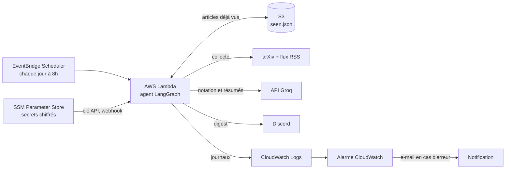
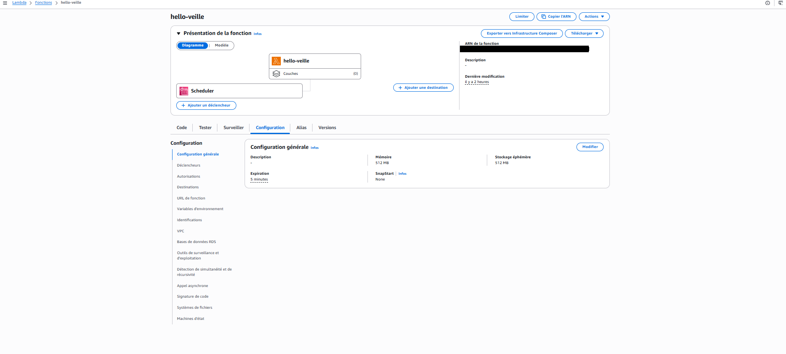
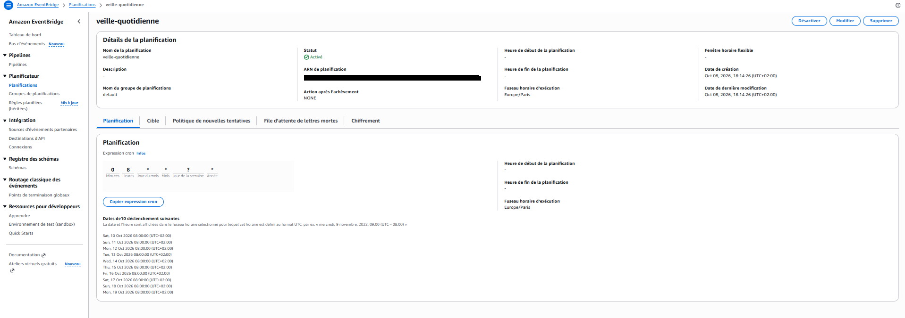
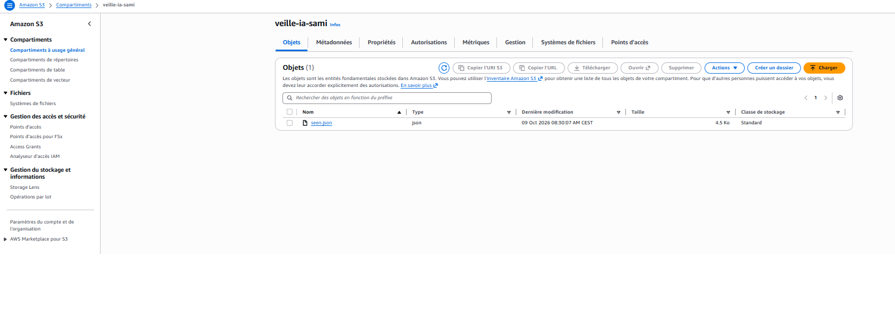
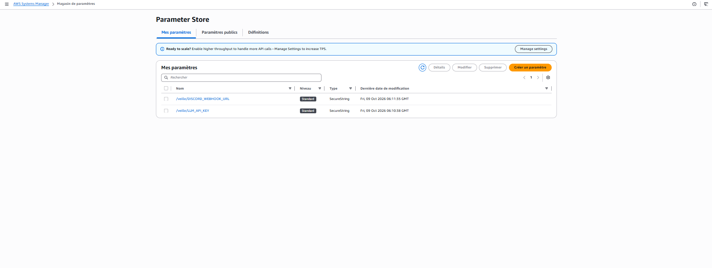
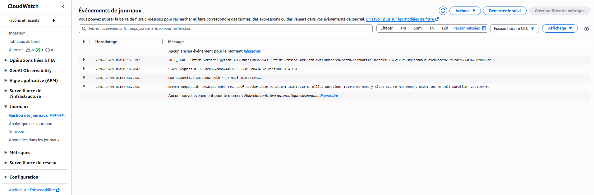
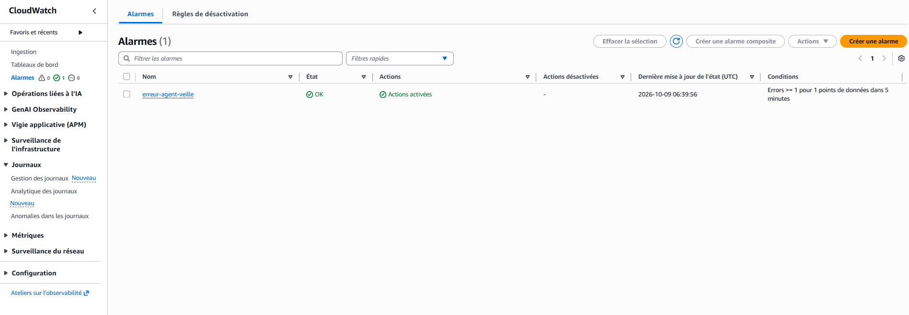

# Agent de veille IA (LangGraph + AWS)

Agent qui collecte chaque jour des articles (arXiv et flux RSS), garde ceux qui sont pertinents grâce à un LLM, les résume en une phrase et envoie un digest quotidien. Il tourne en serverless sur AWS, sans aucun serveur à gérer.

)

## Fonctionnement

L'agent est un graphe LangGraph : chaque étape est une fonction, et deux branches conditionnelles lui permettent de s'arrêter tôt quand il n'y a rien à envoyer.



| Étape | Rôle |
|---|---|
| `collect` | Récupère les articles sur arXiv (plusieurs requêtes) et dans des flux RSS |
| `dedupe` | Écarte les articles déjà vus, équilibre les sources, télécharge le texte des pages qui n'en fournissent pas |
| `score` | Le LLM note la pertinence de chaque article de 0 à 10 selon mes centres d'intérêt |
| `summarize` | Résumé en une phrase des articles retenus |
| `digest` | Mise en forme du message |
| `notify` | Envoi sur Discord (ou affichage dans le terminal) |
| `save_seen` | Mémorise les articles analysés pour ne pas les renvoyer le lendemain |

## Architecture AWS



| Service | Utilité dans le projet |
|---|---|
| **Lambda** | Exécute l'agent (Python 3.12, 512 Mo, délai de 5 minutes) |
| **EventBridge Scheduler** | Déclenche la fonction tous les jours à 8h (fuseau Europe/Paris) |
| **S3** | Conserve la liste des articles déjà vus entre deux exécutions (Lambda ne garde rien) |
| **SSM Parameter Store** | Stocke la clé API et le webhook, chiffrés (SecureString) |
| **CloudWatch** | Journaux d'exécution et alarme e-mail en cas d'erreur |
| **IAM** | Droits minimaux : la fonction ne peut lire et écrire que `seen.json` et ne lit que les paramètres `/veille/*` |








## Sécurité et bonnes pratiques

- Aucun secret dans le code ni dans le dépôt : `.env` est ignoré par Git, et en production les secrets viennent de SSM en `SecureString`.
- Moindre privilège IAM : une politique par besoin, limitée à une ressource précise.
- Le bucket S3 bloque tout accès public.
- Une alarme prévient par e-mail dès qu'une exécution échoue.
- Un budget AWS à dépense nulle alerte au premier centime dépensé.

## Lancer en local

Prérequis : Python 3.12 et soit [Ollama](https://ollama.com) avec un modèle, soit une clé d'API compatible OpenAI.

```bash
pip install -r requirements.txt
cp .env.example .env
python main.py
```

Sous Windows, remplace `cp` par `copy`. Par défaut, l'agent utilise Ollama en local (`gemma3:12b`). Pour une API en ligne (Groq, par exemple), renseigne dans `.env` :

```
LLM_BASE_URL=https://api.groq.com/openai/v1
LLM_API_KEY=...
LLM_MODEL=...
```

Les sujets, les requêtes arXiv, les flux RSS et les seuils se règlent dans `config.py`. Sans webhook Discord, le digest s'affiche dans le terminal.

## Déploiement sur AWS

1. Construire le paquet (bibliothèques Linux + code) : `python build_lambda.py`, qui produit `lambda.zip`.
2. Créer la fonction Lambda (Python 3.12, gestionnaire `lambda_function.lambda_handler`, 512 Mo, délai de 5 minutes) et y charger le zip.
3. Créer un bucket S3 privé et définir la variable `S3_BUCKET`.
4. Créer les paramètres SSM `SecureString` `/veille/LLM_API_KEY` et `/veille/DISCORD_WEBHOOK_URL`, puis définir `SSM_PREFIX=/veille/`.
5. Ajouter au rôle de la fonction deux politiques en ligne : accès à `seen.json` (`s3:GetObject`, `s3:PutObject`, plus `s3:ListBucket` sur le bucket) et lecture des paramètres (`ssm:GetParameters` sur `/veille/*`).
6. Créer un calendrier EventBridge Scheduler (`0 8 * * ? *`, fuseau Europe/Paris) qui invoque la fonction.
7. Créer une alarme CloudWatch sur la métrique `Errors` (somme supérieure ou égale à 1) avec une notification e-mail.

Variables d'environnement de la fonction : `S3_BUCKET`, `LLM_BASE_URL`, `LLM_MODEL`, `LLM_REASONING_EFFORT`, `SSM_PREFIX`.

## Tests

```bash
pip install pytest
python -m pytest
```

Les tests couvrent le graphe (branches conditionnelles, mémoire des articles vus), la collecte, la mémoire S3 et le chargement des secrets SSM. Ils utilisent un faux LLM et de faux clients AWS : aucun appel réseau.

## Limites et pistes d'amélioration

- **Qualité du tri non mesurée** : les notes du LLM sont encore généreuses. Prochaine étape : un petit jeu d'évaluation avec des articles notés à la main, pour comparer avec les notes du modèle.
- **Dépendance à un quota gratuit** : l'API du LLM peut limiter les requêtes. Un mécanisme de nouvelle tentative avec pause est à ajouter.
- **Sources** : seuls arXiv et quelques flux RSS sont suivis, et certains flux ne fournissent pas de texte, ce qui oblige à télécharger la page.
- **Infrastructure sur plan gratuit** : le projet a été déployé avec l'offre gratuite d'AWS, qui est limitée dans le temps. Les captures d'écran ci-dessus documentent l'infrastructure déployée.

## Structure du projet

```
agent-veille/
├── graph.py               graphe LangGraph (étapes et branches)
├── sources.py             collecte arXiv et RSS, texte des pages
├── llm.py                 appel au LLM (API compatible OpenAI)
├── store.py               mémoire des articles vus (fichier local ou S3)
├── notify.py              envoi du digest (Discord ou terminal)
├── parametres.py          chargement des secrets depuis SSM
├── config.py              sujets, sources, seuils
├── lambda_function.py     point d'entrée AWS Lambda
├── build_lambda.py        construction du paquet lambda.zip
├── main.py                lancement en local
├── tests/                 tests unitaires
└── images/                captures d'écran de l'infrastructure
```